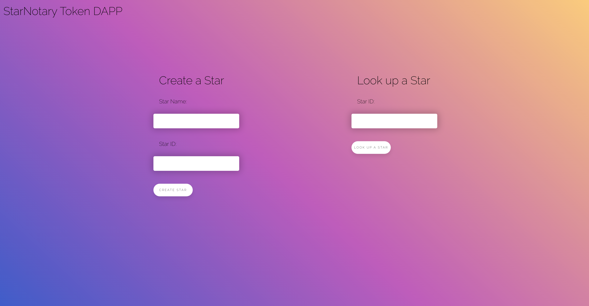
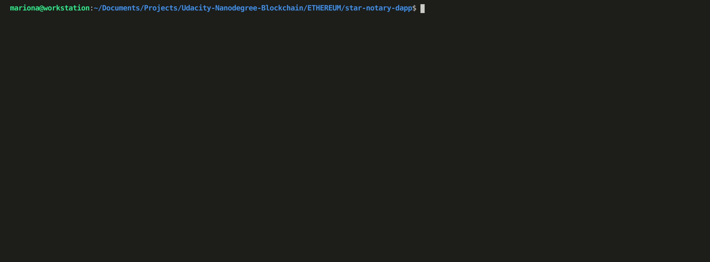

# Star Notary Dapp
## Summary
This project is a Dapp for allow users to create stars and exchange or transfer them using the ERC-721 standard. It's build on top of Rinkeby (Ethereum testnet) and uses Ethereum core technologies like Truffle, Open Zeppelin and Solidity.
Smart contract generates a new token called "SEA" for transferring ownership between the stars created. This token can be found on Etherscan.

See details below for basic config and description and flow about the Dapp, as well as how to set it up and run the tests.

## Config & Basic Info
- ERC-721 Token Name: "Seaona"
- Your ERC-721 Token Symbol: "SEA"
- Contract Address: 0xBE4B214a884B6D091a872ce33b7a9261f8f7556c
- Transaction Hash (Rinkeby): 0x448c8c90338b35fc1a8b9eec90ace0f342675cec6845d186c77248a8b4bf6560
- Truffle v5.2.4 (core: 5.2.4)
- Solidity v0.5.16 (solc-js)
- Node v12.14.1
- Web3.js v1.2.9 
- Openzeppelin-solidity@2.1.2

## Flow
This dapp supports 2 main functionalities:
 ### Create a Star
 This will generate a new transaction and create an ERC721 token corresponding to that Star name and id.

 ### Look for a Star by Id
 This will search for a Star which maps that corresponding id.

## Running Mocha & Chai Tests
In this project, you can find the Unit Tests inside the test folder. 
As Truffle supports and comes preinstalled with Mocha and Chai this is the technology used.
You can run the tests with the commands:
1. ``truffle develop``
2. Inside the truffle console: ``test``

Chai is an Assertion Library

## TODO List
- [x] StarNotary tokens created (SEA tokens).
- [x] Function that looks up the stars using the Token ID, and then returns the name of the star.
- [x] Function called exchangeStars, so 2 users can exchange their star tokens.
- [x] Function for transfer stars between owners.
- [x] Star tokens can be transferred from one address to another
- [x] Unit Tests added
- [x] Deployment on Rinkeby
- [x] Frontend version 1: support creation of stars and look up for stars by id
- [ ] Code refactor for separating styles from html
- [ ] Frontend version 2: support transfer of stars and stars exchange
- [ ] Design: optimize design for mobile, add responsiveness, improve last details
